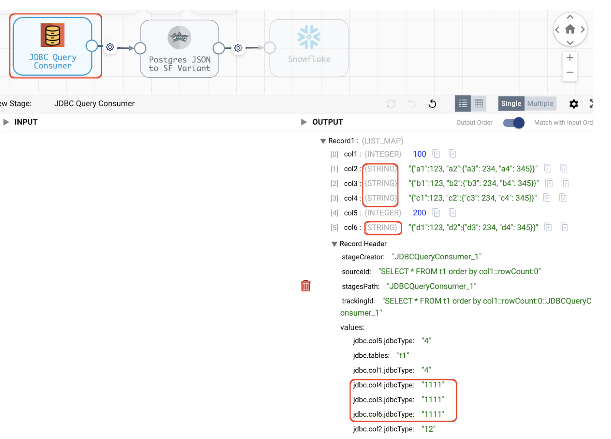
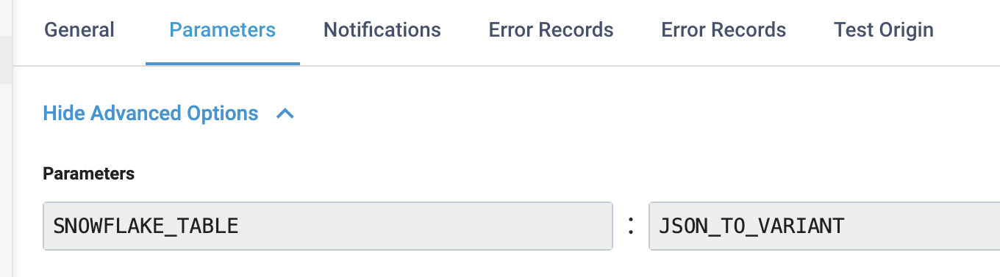
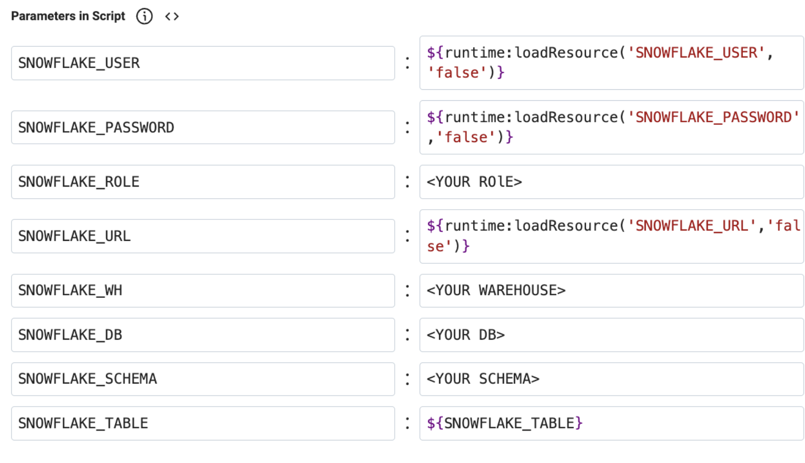

## streamsets_postgres_json_to_snowflake_variants

This project provides an example StreamSets pipeline that automatically writes Postgres JSON Columns to Snowflake variant columns.

A solution like this is currently needed for the following reason:

- StreamSets’ JDBC Query Origin does not currently support the Postgres JSON datatype (see the docs [here](https://www.ibm.com/docs/en/streamsets/6.x?topic=origins-jdbc-query-consumer#concept_sm3_2b4_dmb__title__1)).

- In order for StreamSets’ JDBC Query Origin to capture JSON columns without errors, one needs to set the Advanced property <code>On Unknown Type</code> to the value <code>Convert to String</code> which will allow the JSON data to be read, but StreamSets will see the data as Strings, not JSON.

- However, if StreamSets attempts to insert String data into Snowflake Variant columns, Snowflake will throw errors, as shown below.

### Here's the problem:

Consider a source Postgres Table with a schema like this:
```
	create table t1 (
		col1 int, 
		col2 varchar(255), 
		col3 json, 
		col4 json, 
		col5 int, 
		col6 json);
```
And consider a target Snowflake Table with a schema like this:

```
	create TABLE JSON_TO_VARIANT (
		col1 NUMBER(38,0),
		col2 STRING,
		col3 STRING,
		col4 VARIANT,
		col5 INT,
		col6 VARIANT);
```
Note that col3 is JSON in Postgres but a String in Snowflake, while col4 and col6 are both JSON in Postgres and variants in Snowflake.

The user intends the JSON data from the Postgres col3 to be left as a String to match the pre-existing String datatype of the Snowflake col3, but wants Postgres JSON columns col4 and col6 to be converted to map datatypes to be written to the respective Snowflake variant columns of the same names.

If no remediation is in place, the Postgres JSON columns will be converted to Strings and the user will get the error <code>DATA_LOADING_19 - Field 'COL4' has invalid type 'STRING', column type is 'VARIANT'</code>:

&nbsp;&nbsp;&nbsp;&nbsp;&nbsp;&nbsp;&nbsp;&nbsp;&nbsp;&nbsp;&nbsp;&nbsp;&nbsp;&nbsp;&nbsp;&nbsp;

### A Manual Workaround

It is easy to avoid the problem by statically mapping individual JSON fields at design time to the appropriate datatype by adding a JSON Parser Processor like this for the field col4:

&nbsp;&nbsp;&nbsp;&nbsp;&nbsp;&nbsp;&nbsp;&nbsp;&nbsp;&nbsp;&nbsp;&nbsp;&nbsp;&nbsp;&nbsp;&nbsp;

We can see this resolves the issue for col4 (which is now a complex map) but we would need to add another JSON Parser Processor for col6 as we have not yet remediated that column:

&nbsp;&nbsp;&nbsp;&nbsp;&nbsp;&nbsp;&nbsp;&nbsp;&nbsp;&nbsp;&nbsp;&nbsp;&nbsp;&nbsp;&nbsp;&nbsp;

Having to add a JSON Parser for each field may not be practical; moreover, customers may desire a generalized solution if they have hundreds of pipelines with all different sets of JSON columns, some of which may be the result of joins and/or type-casting in the query.

In the longer term, no workaround would be needed if StreamSets adds JSON type support for Postgres (currently tracked as an IBM enhancement request). In the meantime, an automated solution is possible using a single Groovy processor, as described below.

### An Automated Workaround

Here is an example pipeline that uses a Groovy stage to auto-detect that col4, and col6 need to be converted to map datatypes for Snowflake variants,  while leaving col3 as a String:

&nbsp;&nbsp;&nbsp;&nbsp;&nbsp;&nbsp;&nbsp;&nbsp;&nbsp;&nbsp;&nbsp;&nbsp;&nbsp;&nbsp;&nbsp;&nbsp;

The pipeline, including the Groovy stage and code, is located [here](/pipelines).  For convenience, the Groovy scripts are also posted separately [here](/groovy)

### Groovy Implementation Details

The Groovy init script runs only once, at pipeline startup. This script retrieves the Snowflake target table’s column names and data types and saves that information in the global cache.

The Groovy main script pays special attention to the pipeline’s first record.  When processing the first record, the main Groovy script parses that record's JDBC metadata. Note that although col2, col3, col4 and col6 are seen as Strings, the JDBC metadata jdbcType lets us know that col3, col4, and col6 are actually JSON (the jdbcType value is “1111”) as shown here:

&nbsp;&nbsp;&nbsp;&nbsp;&nbsp;&nbsp;&nbsp;&nbsp;&nbsp;&nbsp;&nbsp;&nbsp;&nbsp;&nbsp;&nbsp;&nbsp;

While processing the first record, the main Groovy script matches the names of JSON source columns to the names of Snowflake target columns, and if the matching Snowflake column is of type variant, those JSON column names are stored in a global cache, as these are the columns that need to be converted to JSON.

For all records, the main Groovy script converts the JSON columns whose names are in the global cache.

*Important note:  the script performs its Postgres to Snowflake column mapping by lower-casing all column names, so if by chance you have case sensitive column names with multiple column names with the same characters in the same table with different cases  (and I sure hope you don’t!), the mapping may not be correct.*


### Pipeline Configuration

To configure the pipeline, set the Snowflake target table in the Pipeline Parameter:

&nbsp;&nbsp;&nbsp;&nbsp;&nbsp;&nbsp;&nbsp;&nbsp;&nbsp;&nbsp;&nbsp;&nbsp;&nbsp;&nbsp;&nbsp;&nbsp;

Set your Snowflake connection parameters in the Groovy stage’s Advanced properties.   Note that the Snowflake user, password,and URL are loaded from runtime resources:

&nbsp;&nbsp;&nbsp;&nbsp;&nbsp;&nbsp;&nbsp;&nbsp;&nbsp;&nbsp;&nbsp;&nbsp;&nbsp;&nbsp;&nbsp;&nbsp;


